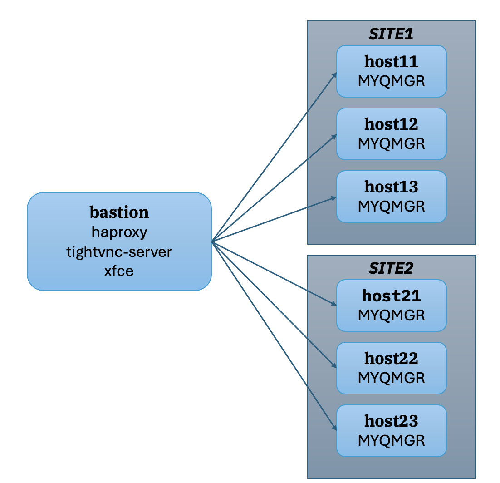

# Environment preparation

The environment is run with 7 VMs running RHEL 9. The first 3 is running the first site and then another 3 running as the backup site; one VM running as the load balancer and bastion node. 

The configuration is as follows: 

The setup is using a minimal 2CPU 8GB RAM for the MQ servers and the load balancer.

## Setting up SSH connectivity

## Setting up haproxy 

## Enabling GUI for bastion (optional - to use MQ Web)

