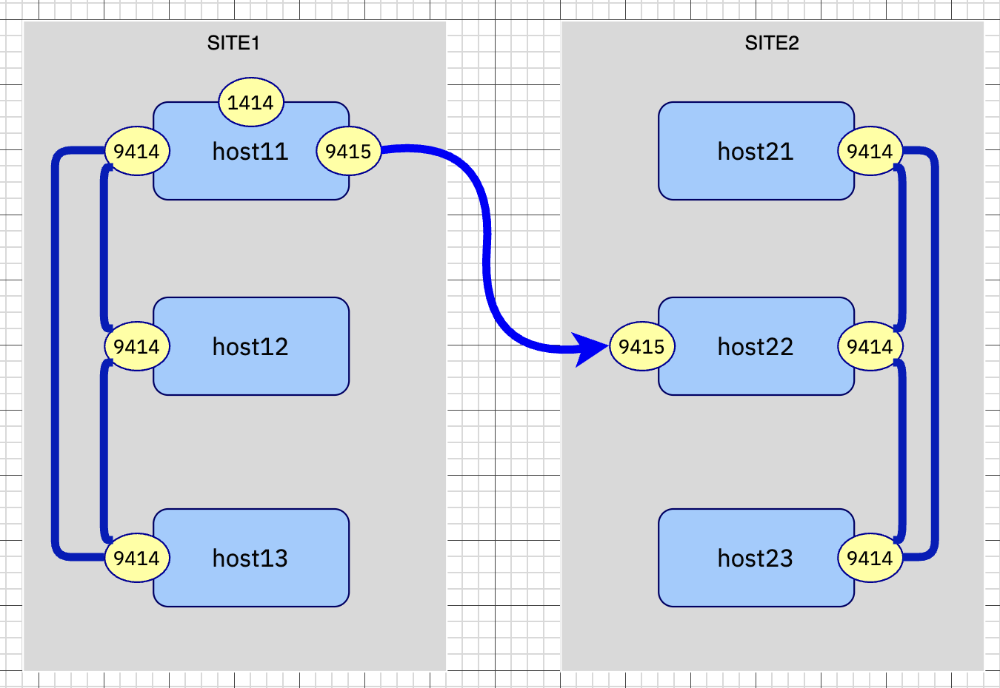

# Creating the nativeHA qMGR

The queue manager must be installed on all 6 VMs. The automated installation process is provided in [scripts/3-0-createqm.sh](scripts/3-0-createqm.sh).

If you choose to manually create the Queue Managers yourself. You must perform the following on all 6 servers.

## Create Queue Manager

1. Login as mqm user. 

    ``` bash
    sudo su - mqm
    ```

2. Create the Queue Manager; remember to increase the log file size and number. Also to give the proper instance name so the communication between the nativeHA member can be established. The Queue Manager name must be the same for all 6 servers. 

    ``` bash
    curnode=$(hostname -s)
    qmname=MYQMGR
    crtmqm -lr ${curnode} -lf 8192 -lp 10 -ls 10 -p 1414 ${qmname}
    ```

3. Modify the configuration file in `/var/mqm/qmgrs/<qmname>/qm.ini` and add the following:

    ```
        . . .
    NativeHALocalInstance:
        Name=${host11}
        GroupName=${site1}
        GroupRole=Live
        GroupLocalAddress=(9415)
    NativeHARecoveryGroup:
        GroupName=${site2}
        ReplicationAddress=${=ip21}(9415),${ip22}(9415),${ip23}(9415)
        Enabled=Yes
    NativeHAInstance:
        Name=${host11}
        ReplicationAddress=${ip11}(9414)
    NativeHAInstance:
        Name=${host12}
        ReplicationAddress=${ip12}(9414)
    NativeHAInstance:
        Name=${host13}
        ReplicationAddress=${ip13}(9414)
    ```

    - NativeHALocalInstance: defining the local group, its name, its Role and the listening port; so this group is the *Live* group, which listen to port 9415.
    - NativeHARecoveryGroup: this defines the partner group, and whether it will tries to connects to those replication addresses
    - NativeHAInstance: these define the group partners within the local group.

To illustrate the communication defined in the above configuration, see the following picture.




## Create MQ Monitor systemd process

To make it easy to work across systems and enable a simple monitor, MQ provides a sample systemd process. The systemd helps to start, stop and monitor the Queue Manager process. To enable the systemd mqmonitor, use the script in [scripts/3-2-mqmonitor.sh](scripts/3-2-mqmonitor.sh). 

1. You link the sample systemd definition to the system directory (must be run as root, so using the `sudo` command)

    ``` bash
    sudo ln -s /opt/mqm/samp/mqmonitor@.service /etc/systemd/system 
    ```

2. For each queue manager, you enable the individual service and starts them:

    ``` bash
    sudo systemctl enable mqmonitor@${qmgr}
    ```

3. The enable command creates the service definition, the file it creates is in `/etc/systemd/system/mqmonitor@<qmgr>.service`. If your environment is accessing AD for authentication, it is recommended to have an additional environment variable called `MQS_GETGROUPLIST_API` and set it to `1`. 

    ```
     Environment=MQS_GETGROUPLIST_API=1
    ```

4. Start the service, then subsequently let the service manage the status of the queue manager.

    ```
    sudo systemctl start mqmonitor@${qmgr}
    ```