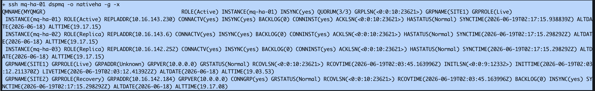
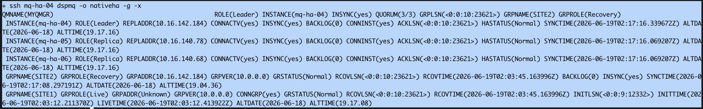
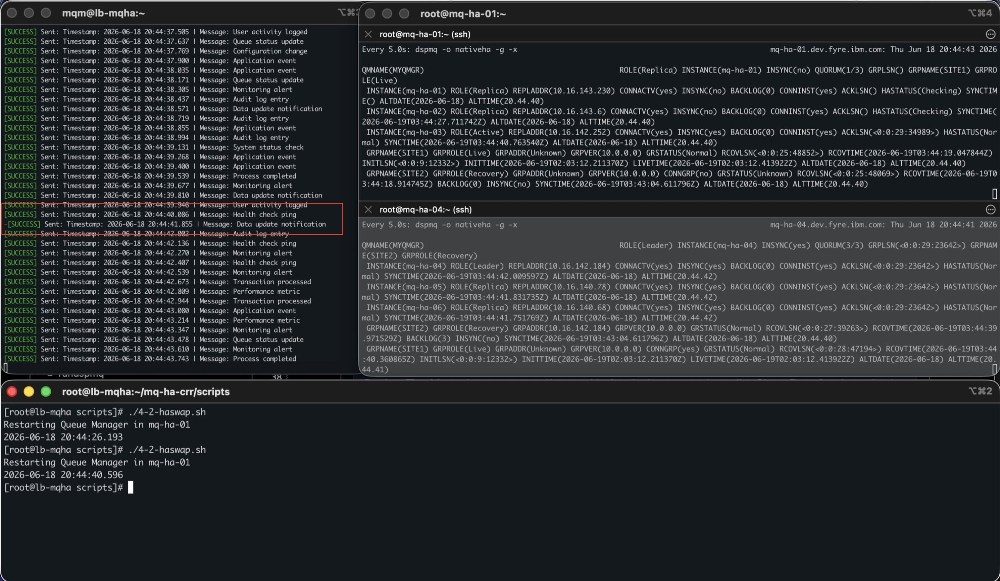

# Demonstrate Native HA and Planned Site Switch

This section begins the demonstration portion of IBM MQ Native HA and CRR functionality. This unit covers two scenarios: automatic Native HA failover within a single site, and a planned site-wide switch between the Live and Recovery groups.

You will primarily work with the SITE1 environment — hosts `host11`, `host12`, and `host13` — for the Native HA portion, and both sites for the planned switch.

- [Understanding Native HA](#understanding-native-ha)
- [Demonstrating Automatic Failover](#demonstrating-automatic-failover)
- [Demonstrating Planned Site Switch](#planned-site-switch)

## Understanding Native HA

To inspect the Native HA and CRR environment, use the following command on any Queue Manager host:

```bash
dspmq -o nativeha -g -x -m <qmgr>
```

The options are:

- `-o nativeha` — limits output to Native HA and CRR information only
- `-x` — shows the individual members of the local Native HA group
- `-g` — shows both the local group and the remote (recovery) group
- `-m <qmgr>` — specifies which Queue Manager to report on

From the bastion, you can run the convenience script [scripts/4-1-checkhacrr.sh](scripts/4-1-checkhacrr.sh), which queries all hosts and formats the output.

The following are sample outputs from a Live site and a Recovery site:




The command can be run from any instance in the group — there is no fixed preference for which instance will be active at any given time.

Reading the output:

- The **first line** shows a brief summary of the Queue Manager status on the local host.
- The **`INSTANCE` lines** list the individual members of the local Native HA group (from `-x`). The key fields are:
    - `ROLE` — can be `Active`, `Leader`, or `Replica`. Only the `Active` instance accepts client connections; the others replicate the log but do not serve clients.
    - `CONNACTV` — indicates whether the replication connection on port 9414 is currently established.
    - `INSYNC` — shows whether the member's log is fully caught up. When in sync, `BACKLOG` should be `0` and all `ACKLSN` values should be identical.
- The **`GRPNAME` lines** show the status of the CRR-connected groups (from `-g`). The key fields are:
    - `GRPROLE` — either `Live` or `Recovery`, indicating the role of this group.
    - `GRSTATUS` — should be `Normal` for a healthy group. Any other value indicates a problem.
    - The remote group should show `INSYNC` as `Yes`.
    - When fully synchronised, all `RECOVLSN` values should match the `ACKLSN` of the individual instances. `RECOVLSN` represents the last log position that the remote group has confirmed receiving.

> **Tip:** LSN (Log Sequence Number) values are more reliable than wall-clock timestamps for assessing synchronisation status, as they directly reflect the log position rather than time.

## Demonstrating Automatic Failover

Native HA automatically promotes a Replica instance to Active when the current Active instance becomes unavailable. This demonstration shows how quickly that promotion occurs and how little data is lost.

Follow this procedure:

1. Open three terminal (SSH) sessions to the bastion host.

2. **Session 1 — Monitor:** SSH to one of the Live Queue Manager hosts (assuming SITE1 is Live) and run a continuous `dspmq` watch:

    ``` bash
    ssh ${host11}
    watch -n 5 dspmq -o nativeha -g -x
    ```

    This window will show the role changes in real time as the failover happens.

3. **Session 2 — Message sender:** Copy and start the message sender script. It sends a timestamped message every 0.1 seconds, so any gap in delivery is immediately visible:

    ``` bash
    cp scripts/mq_message_sender.sh /tmp
    su - mqm -c "/tmp/mq_message_sender.sh"
    ```

4. **Session 3 — Trigger failover:** Restart the `mqmonitor` service on the currently active host to force a failover. One of the Replica instances will be elected Active:

    ``` bash
    ssh <activemqhost> sudo systemctl restart mqmonitor@<qmgr>
    ```

    If you do not know which host is currently Active, use the helper script instead — it queries `dspmq` to find the Active instance automatically:

    ``` bash
    bash scripts/4-2-haswap.sh
    ```

5. Watch both Session 1 and Session 2. You will see:
    - In Session 1: the `ROLE` field changes. The restarted host transitions to `Replica`; another host is promoted to `Active`.
    - In Session 2: the sender logs a short run of failures, then resumes. The gap between the last successful message before the failover and the first successful message after should be less than 2 seconds.

    

    In the highlighted section, the time between successful messages is approximately 1.7 seconds.

    Repeat the failover several times to confirm that the recovery time is consistent regardless of which instance is currently Active.

## Planned Site Switch

A planned site switch transfers the Live role from one site to the other in a controlled manner. This is the standard procedure for scheduled maintenance or data-centre switching, and it preserves all committed transactions.

This demonstration requires four terminal sessions:

| Session | Command |
|---------|---------|
| 1 | `ssh ${host11} watch -n 5 "dspmq -o nativeha -g -x -m ${qmname}"` |
| 2 | `ssh ${host21} watch -n 5 "dspmq -o nativeha -g -x -m ${qmname}"` |
| 3 | `mq_message_sender.sh` (continuous message stream) |
| 4 | Failover script and status checks |

Follow this procedure:

1. Confirm which site is currently Live. In these steps we assume SITE1 is Live. Then run the planned swap script from Session 4:

    ``` bash
    bash scripts/5-1-siteswap.sh
    ```

2. While the script executes, observe the `dspmq` windows. The site role transitions follow this sequence:

    - **SITE1:** `Live` → `Unknown` → `Pending Recovery` → `Recovery`
    - **SITE2:** `Recovery` → `Unknown` → `Pending Live` → `Live`

    The `Unknown` state is transient — it appears while the Queue Managers negotiate the role change. The `Pending` states indicate that a site has committed to its new role but is waiting for the counterpart to confirm.

3. In Session 3, observe how long the message sender reports failures. The planned switch is a cooperative process, so both sites coordinate the handover. Typically the sender experiences a gap of **7–15 seconds**, which is longer than an automatic Native HA failover (which is under 2 seconds) but ensures zero data loss.

4. Run `5-1-siteswap.sh` several more times to observe the behaviour across multiple switches and confirm that the transition time is consistent.
