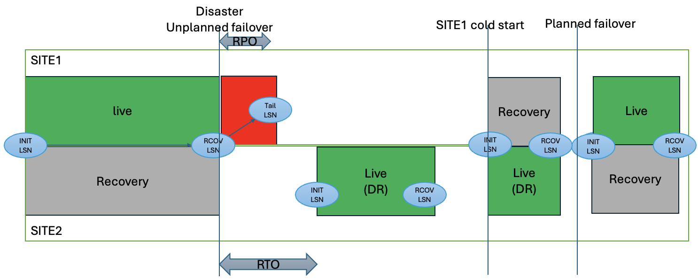

# Unplanned Switch — Disaster Recovery


## Disaster

Simulate a disaster with the following steps:

1. Stop all message input by terminating the `mq_message_sender.sh` program.

2. Drain the queue by running `mq_message_receiver.sh`.

3. Confirm that the `QDEPTH` of `QUEUE1` is `0` before continuing.

4. Send 5 messages to `QUEUE1` so they are replicated to SITE2:

    ``` bash
    echo "/tmp/mq_message_sender.sh -m 5" | su - mqm
    ```

5. Shut down all Queue Managers:

    ``` bash
    ./4-3-sitecmd.sh SITE1 stop
    ./4-3-sitecmd.sh SITE2 stop
    ```

6. Bring up a Live environment on SITE2 and check its status:

    ``` bash
    ./5-2-siteset.sh SITE2 Live
    ./4-3-sitecmd.sh SITE2 start
    ./rundspmq ${host21}
    ```

7. Note that `GRPROLE` is `Pending live` and `GRSTATUS` is `Waiting for connection`. This is because the Recovery group is still enabled and waiting for the other site to reconnect. Disable CRR and restart:

    ``` bash
    ./4-3-sitecmd.sh SITE2 stop
    ./6-1-crrswitch.sh SITE2 No
    ./4-3-sitecmd.sh SITE2 start
    ./rundspmq ${host21}
    ```

8. Once the Queue Manager is active, send another 5 messages, then receive all messages and verify that you receive 10 in total (5 from step 4 and 5 from this step):

    ``` bash
    echo "/tmp/mq_message_sender.sh -m 5" | su - mqm
    echo "/tmp/mq_message_receiver.sh QUEUE1 MYQMGR mqm mqm" | su - mqm
    ```

## Recovery

To restore the full CRR environment, perform the following steps:

1. Stop SITE2 and re-enable CRR:

    ``` bash
    ./4-3-sitecmd.sh SITE2 stop
    ./6-1-crrswitch.sh SITE2 Yes
    ./4-3-sitecmd.sh SITE2 start
    ```

2. Configure SITE1 as the Recovery site and start it:

    ``` bash
    ./5-2-siteset.sh SITE1 Recovery
    ./4-3-sitecmd.sh SITE1 start
    ```

3. Check the status:

    ``` bash
    ./4-1-checkhacrr.sh
    ```

    - Watch for SITE2 `GRPROLE` to become `Live`.
    - Watch SITE1's `INSYNC` and `BACKLOG` — eventually `INSYNC` becomes `Yes` and `BACKLOG` becomes `0`.

## Split Brain

To simulate a split-brain scenario, send a continuous message stream to the Queue Managers while abruptly stopping SITE2. The resulting state is illustrated below:



1. Stop all message input and swap the active site back to SITE1:

    ``` bash
    ./5-1-siteswap.sh
    ```

2. Drain the queue by running `mq_message_receiver.sh`.

3. Confirm that the `QDEPTH` of `QUEUE1` is `0` before continuing.

4. Send 5 messages to `QUEUE1` so they are replicated. Note the messages received:

    ``` bash
    echo "/tmp/mq_message_sender.sh -m 5" | su - mqm
    ```

5. Shut down the SITE2 Queue Managers to simulate a network failure where logs are not replicated:

    ``` bash
    ./4-3-sitecmd.sh SITE2 stop
    ```

6. Send 2 more messages. These messages cannot be propagated to SITE2 because it is stopped:

    ``` bash
    echo "/tmp/mq_message_sender.sh -m 2" | su - mqm
    ssh $host11 dspmq -o nativeha -g
    ```

    Save the `RECOVLSN` value — you will need it to identify uncommitted transactions later.

7. Stop SITE1 and promote SITE2 to Live without CRR enabled, then check its status:

    ``` bash
    ./4-3-sitecmd.sh SITE1 stop
    ./5-2-siteset.sh SITE2 Live
    ./6-1-crrswitch.sh SITE2 No
    ./4-3-sitecmd.sh SITE2 start
    ```

8. Attempt to restore full CRR by configuring SITE1 as Recovery and re-enabling CRR on SITE2:

    ``` bash
    ./5-2-siteset.sh SITE1 Recovery
    ./6-1-crrswitch.sh SITE2 Yes
    ./4-3-sitecmd.sh SITE2 stop
    ./4-3-sitecmd.sh SITE1 start
    ./4-1-checkhacrr.sh
    ```

    - Review the status output.
    - Do you see `GRSTATUS` of `Partitioned`?
    - Save the `checkhacrr` output, paying particular attention to the LSN values.

9. Stop all Queue Managers:

    ``` bash
    ./4-3-sitecmd.sh SITE1 stop
    ./4-3-sitecmd.sh SITE2 stop
    ```

10. Dump the MQ log for SITE1 starting from the saved `RECOVLSN` to examine uncommitted transactions:

    ``` bash
    source hacrrenv.sh
    ssh $host11 "dmpmqlog -m MYQMGR -s <RECOVLSN> -r ObjectName=QUEUE1" 
    ```

11. Analyse the output to understand which messages were committed on SITE1 but not replicated to SITE2.

12. Cold-start SITE1 to discard its diverged log:

    ``` bash
    ./6-0-coldsite.sh SITE1
    ```

13. Reconfigure the environment with SITE1 as Live and SITE2 as Recovery, and verify full CRR operation.
